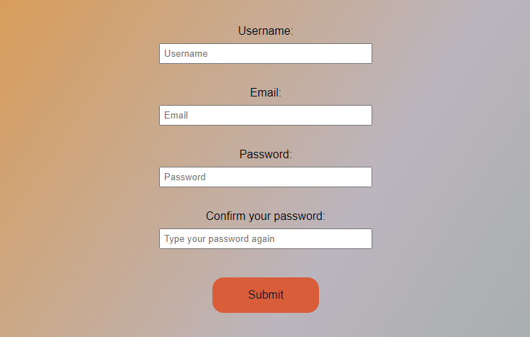

# Form Validation

A Javascript exercise done during my training at [BeCode](https://becode.org/all-trainings/pedagogical-framework-junior-developer/).

## The Goal

The project was to create a form validation.

## What does it look like ?

Check the result ➡️ [here](https://dystrima.github.io/Exercise-Form_validation/) ⬅️

